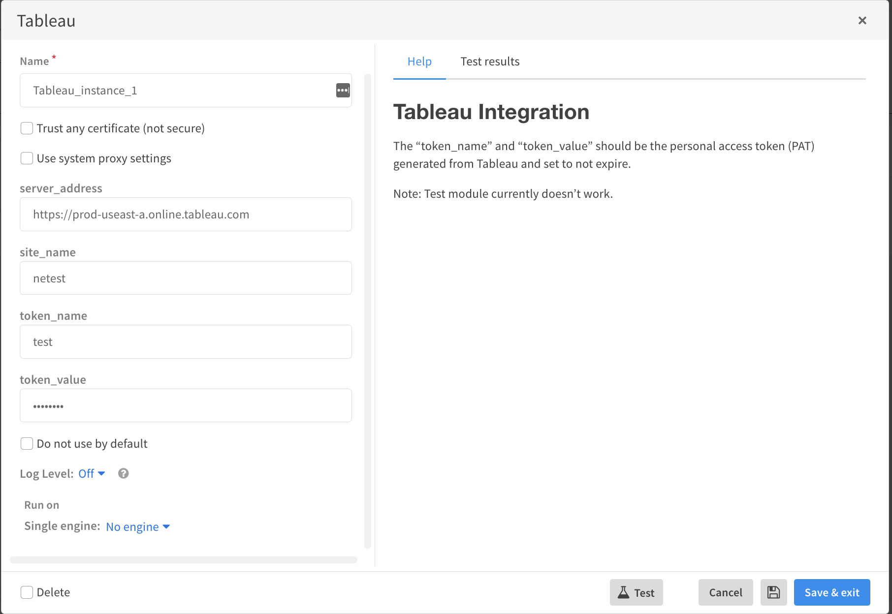
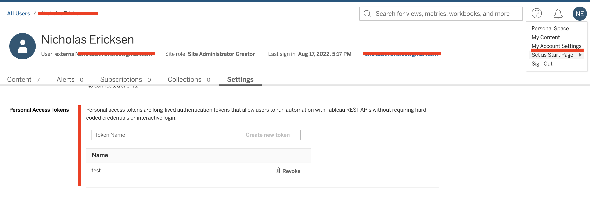
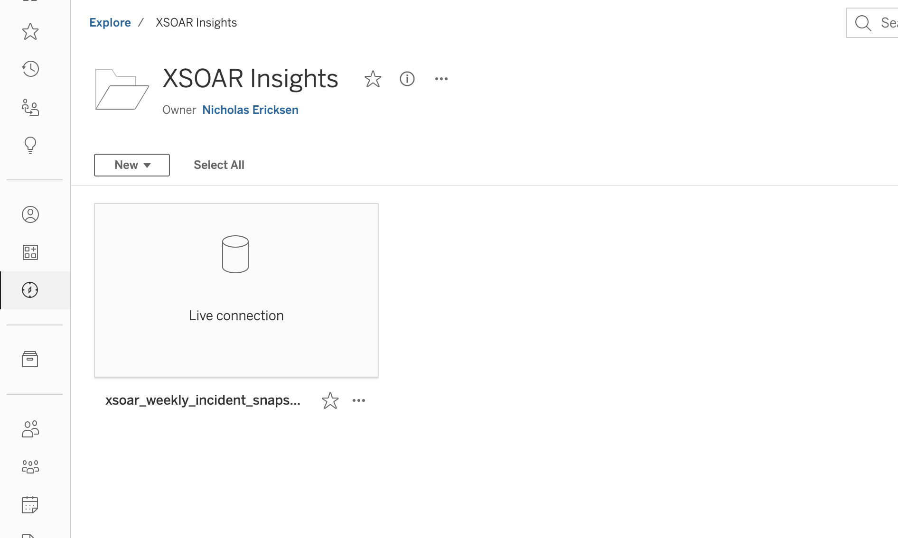
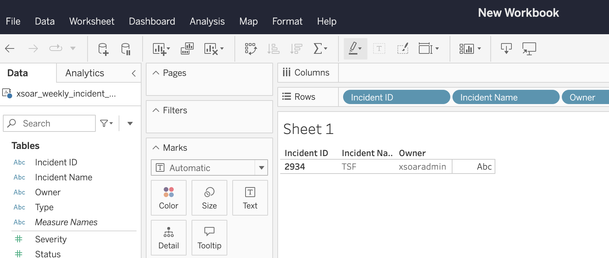

# Tableau + XSOAR
This integration and playbook demonstrates how to sync incident data between XSOAR and Tableau.


### Create Docker image

First create the custom docker image to run the Tableau client SDK.

```
/docker_image_create name=tableau base="demisto/python3-deb:3.8.2.6981" dependencies=tableauserverclient,tableauhyperapi
```

### Configure XSOAR
You can then configure the integration in XSOAR.



The `Site Name` and `Server URL` can be taken from the URL you use to navigate to Tableau in your browser.


A Personal Access Token should then be created under the users account




### Setup Project and Sync Data
You can then create a Project using XSOAR CLI.

```
!tableau-create-project project_name="XSOAR Insights"
```

The `Tableau Weekly Incident Data Sync` playbook can then be run to publish incident data for the last 7 days.
This can be modified as needed.


After the playbook is run you will see a hyper file created in the Tableau project which can be used as a data source in a workbook.





When the XSOAR playbook runs again it will publish the updated data and the workbook will reflect the changes!


### Known Limitations

Currently only a few fields are hardcoded from incident data.  This is because you must know the strucutre of the data to put into the Tableau hyper
before creating and inserting the data.  This can be extended by modifying the following lines in the integration for now


```
    extract_table = TableDefinition(
        table_name=TableName("Extract", "Extract"),
        columns=[
            TableDefinition.Column(name='Incident ID', type=SqlType.text(), nullability=NOT_NULLABLE),
            TableDefinition.Column(name='Incident Name', type=SqlType.text(), nullability=NOT_NULLABLE),
            TableDefinition.Column(name='Type', type=SqlType.text(), nullability=NOT_NULLABLE),
            TableDefinition.Column(name='Status', type=SqlType.big_int(), nullability=NOT_NULLABLE),
            TableDefinition.Column(name='Severity', type=SqlType.big_int(), nullability=NOT_NULLABLE),
            TableDefinition.Column(name='Owner', type=SqlType.text(), nullability=NOT_NULLABLE)
        ]
    )

```

and later on when it is uploaded

```
data_to_insert = [[d["id"], d["name"], d["type"], d["status"], d["severity"], d["owner"]] for d in data]
```
